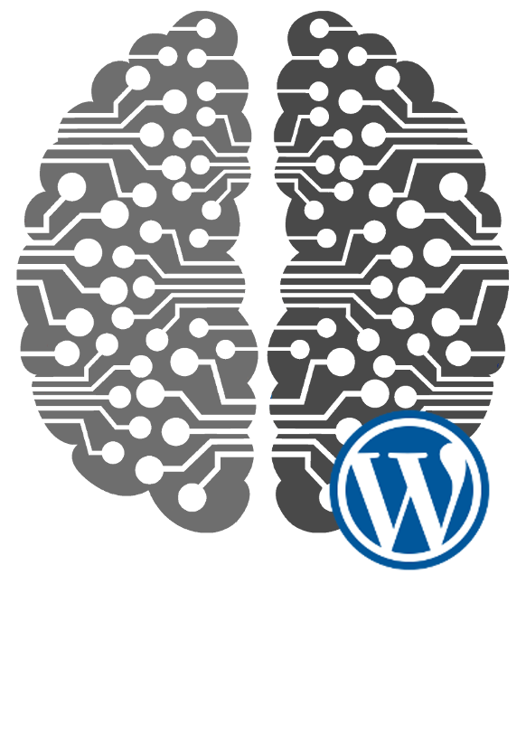

<p align="center">

h1> CrowdSec Wordpress Blocker </h1>
</p>
<p align="center">


</p>
<p align="center">
:books: <a href="https://doc.crowdsec.net/blockers/wordpress/installation/">Documentation</a>
:diamond_shape_with_a_dot_inside: <a href="https://hub.crowdsec.net">Hub</a>
:speech_balloon: <a href="https://discourse.crowdsec.net">Discourse </a>
</p>


## Installation

### Prepare the .zip folder

```make zip```

### Deploy the plugin

```
- Go to wordpress backend
- Go to 'Plugins' -> 'Add New' And click on "Upload Plugin" (at the top of the page)
- Choose your zipped plugins file and install it
- Now you can activate it and see a new menu named "Crowdsec"
```

### Settings

##### Crowdsec (Activate by default)

- You can activate or not the CrowdSec data query (you must have a crowdsec instance running on your host)
- If this option is activated, please fill the path to crowdsec database file

:warning: If you disable the Crowdsec decision pull, don't forget to `Refresh Cache`

##### General

 - Activate or not the block on the backend also
 
The cache can be flushed manually by clicking the `Refresh Cache` button. 

### Dashboard

Currently, the dashboard contains only a table with all IPs that are actually stored in cache.


